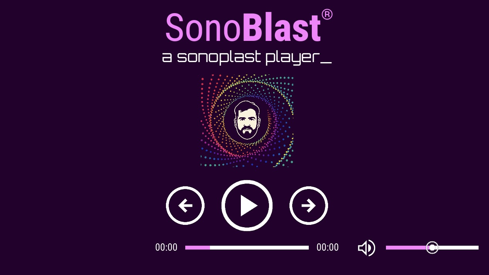

# 🎧 SonoBlast

**SonoBlast** is a custom Kivy-based UI player interface for sound designers and live audio operators. It provides a highly visual, grid-based layout with touch-optimized components for precise control over playback and volume.

---

## 📦 Features

- 🧱 Grid-based responsive layout using constants
- 🎨 Custom canvas sliders with visual cursor
- 🎮 Play, forward, reverse controls with toggleable icons
- 📊 Volume slider with extended touch area for touchscreens
- 🕓 Track position indicator and time labels
- 🎯 All layout logic tied to centralized constants for easy scaling

---

## 🖥️ Preview



---

## 🚀 Getting Started

### 1. Clone the repository

```bash
git git@github.com:felipeleal89/jetson_ui.git
cd jetson_ui