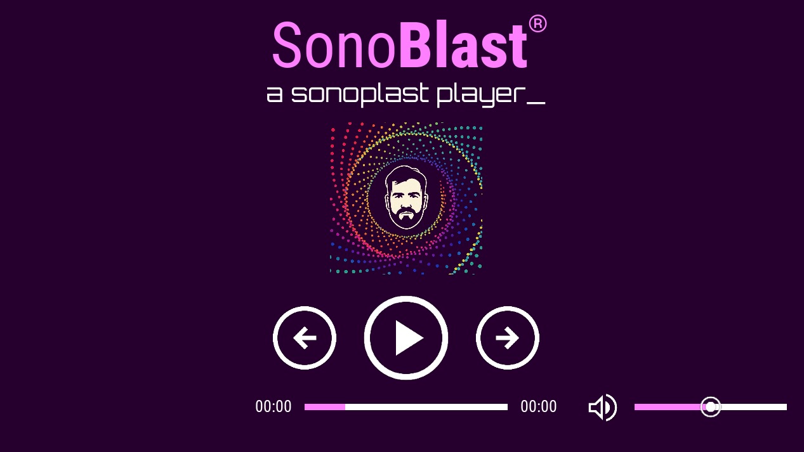

# 🎧 SonoBlast

**SonoBlast** is a modern, touch-optimized Kivy-based audio control interface designed for performance scenarios like sound design, installations, and embedded systems. Built for the Jetson Nano, it features canvas-rendered sliders, playback control buttons, and a responsive layout grid.


---

## 🚀 Features

- 🧱 Grid-aligned scalable layout
- 🔊 Custom volume slider with visual cursor
- ⏯️ Play, forward, and reverse toggle buttons
- 📈 Track progress indicator
- 🖐️ Touch-friendly hitboxes
- 🤖 Deploy-ready for Jetson Nano via Ansible
- 📦 Python packaging via `pyproject.toml`

---

## 🛠️ Requirements

- Python ≥ 3.9
- [`uv`](https://github.com/astral-sh/uv) – fast virtualenv + dependency manager
- `git`
- `ansible` (tested on Jetson)

---

## 📁 Project Structure

```
jetson_ui/
├── images/                     # UI icons
├── fonts/                      # Fonts used in UI
├── sonoplast.py                # Main application file
├── pyproject.toml              # Project metadata and dependencies
├── requirements.txt            # Flat requirements (generated)
├── deploy_ui.yml               # Ansible playbook
├── inventory.yml               # Ansible inventory
└── README.md                   # This file
```

---

## ⚙️ Local Installation (with `uv`)

### 1. Clone the project

```bash
git clone https://github.com/felipeleal89/jetson_ui.git
cd jetson_ui
```

### 2. Install `uv`

```bash
curl -Ls https://astral.sh/uv/install.sh | bash
# Then restart your terminal or add ~/.cargo/bin to PATH
```

### 3. Create virtual environment and install dependencies

```bash
uv venv
uv sync
```

### 4. Run the app

```bash
python sonoplast.py
```

> By default, the app runs in fullscreen. You can disable this in `sonoplast.py`:
>
> ```python
> Window.fullscreen = False
> ```

---

## 🤖 Deploy to Jetson Nano via Ansible

### 1. Set your device in `inventory.yml`

```yaml
all:
  hosts:
    jetson:
      ansible_host: target ip addr
      ansible_user: target user
      ansible_python_interpreter: /usr/local/bin/python3.9
```

### 2. Run the playbook

```bash
ansible-playbook -i inventory.yml deploy_ui.yml
```

This will:

- Create or update `/home/your_user/jetson_ui` on Jetson
- Pull the latest code via `git`
- Activate the virtual environment `.venv`
- Run `sonoplast.py` silently in the background

---

## 🔧 Customization

- Change `GRID_SIZE`, `WINDOW_SIZE_X`, `WINDOW_SIZE_Y` in `sonoplast.py` to scale the layout.
- Replace any icons in the `images/` folder and fonts in `fonts/`.

---

## 📦 Dependencies

Below is a flat list of dependencies (also available in `requirements.txt`):

```
certifi>=2025.7.14
charset-normalizer>=3.4.2
docutils>=0.21.2
filetype>=1.2.0
idna>=3.10
kivy>=2.3.1
kivy-garden>=0.1.5
pillow>=11.3.0
pip>=25.1.1
platformdirs>=4.3.8
pygments>=2.19.2
requests>=2.32.4
setuptools>=80.9.0
urllib3>=2.5.0
```

---

## 🧑‍💻 Author

**[Felipe Leal]**  
[https://github.com/felipeleal89](https://github.com/felipeleal89)  
---

## 📜 License

MIT License. See `LICENSE` for details.
